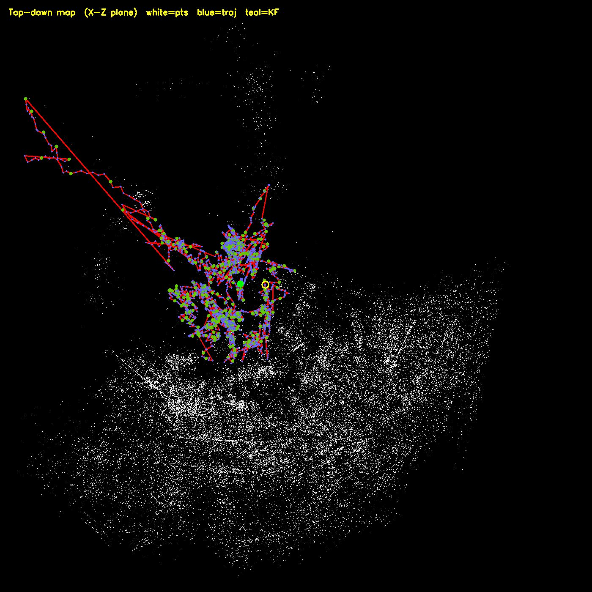
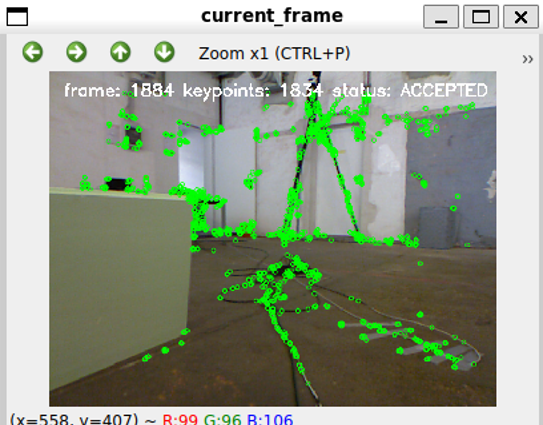

# SLAM System Final Project

Navigation Algorithms final project - Visual Odometry and 3D Reconstruction.

This repository contains a C++ implementation of a monocular RGB SLAM / visual odometry system. The project takes a sequence of images, estimates the camera motion between frames, builds a sparse 3D point cloud of the scene, and shows the trajectory and map while the program is running.

The submitted project received a grade of 100.

## What this project does

The goal of the project is to take an ordered image sequence and reconstruct both:

- the camera trajectory
- a 3D point map of the environment

The system does this using classical computer vision methods. It starts from ORB features, matches them between consecutive frames, estimates the relative camera motion with epipolar geometry, triangulates 3D points, and then keeps improving the tracking using keyframes, PnP relocalization, reprojection checks, and loop closure logic.

This version is focused on a monocular RGB pipeline. That means it does not rely on depth images for the main SLAM pipeline. Because it is monocular, the map and trajectory are reconstructed up to an unknown scale.

## Screenshots

These screenshots are from one of the working runs. They are mainly here to show the kind of output the system produces while running.

### Top-down map output

White points are reconstructed map points. The trajectory is drawn on top of them, and keyframes are highlighted.



### Current frame with detected keypoints

The current frame window shows the image that is being processed and the detected keypoints used for tracking.



## Main pipeline

The pipeline is roughly:

1. Load the dataset frames.
2. Build the camera intrinsic matrix from the image size, or use intrinsics passed from the command line.
3. Extract ORB keypoints and descriptors for each frame.
4. Match features between consecutive frames using BF matching and filtering.
5. Estimate the essential matrix with RANSAC.
6. Compute epipolar error and reject unstable steps.
7. Recover relative camera motion from the essential matrix.
8. Compose the relative poses into a global trajectory.
9. Triangulate inlier matches into 3D map points.
10. Select keyframes and store their descriptors in a small keyframe database.
11. Run periodic PnP relocalization against existing map points.
12. Refine PnP poses with pose-only Levenberg-Marquardt optimization.
13. Try loop closure between distant keyframes and apply a correction when it is verified.
14. Show the trajectory and map live, and save diagnostics files after the run.

## Features implemented

- Monocular RGB frame loading
- ORB feature extraction
- Descriptor matching with Lowe ratio filtering
- Essential matrix estimation with RANSAC
- Epipolar error diagnostics
- Relative pose recovery with `recoverPose`
- Global pose composition
- Sparse 3D map creation by triangulation
- Map points with frame/keypoint observations
- Keyframe selection
- Simple keyframe database for loop candidates
- Periodic PnP relocalization using world-frame map points
- Reprojection error calculation
- Pose-only LM optimization
- Loop closure candidate detection and geometric verification
- Pose/map correction after verified loop closure
- Pangolin trajectory and map viewer
- OpenCV windows for keypoints and matches
- CSV and text diagnostics for debugging tracking quality
- Top-down map export as `top_down_map.png`

## Repository structure

```text
CMakeLists.txt             Build configuration
main.cpp                   Dataset loading, main loop, outputs
pose.h                     Camera pose convention and pose helpers
frame.h                    Frame data: image, features, descriptors, pose
map_point.h                3D map point and observations
slam_map.h/.cpp            Owns frames, map points, keyframes
feature_matcher.h/.cpp     ORB extraction and feature matching
epipolar_geometry.h/.cpp   Essential matrix, pose recovery, epipolar error
triangulation.h/.cpp       3D point triangulation from two views
pnp_relocalizer.h/.cpp     PnP solver and reprojection error
optimization.h/.cpp        Pose-only LM optimization
keyframe_db.h/.cpp         Keyframe descriptor database
loop_closure.h/.cpp        Loop candidate verification and correction
diagnostics.h/.cpp         Per-frame tracking diagnostics and output files
viewer.h/.cpp              Pangolin/OpenCV visualization and map image export
```

## Requirements

The project is written in C++17 and uses:

- CMake
- OpenCV
- Eigen3
- Pangolin
- OpenGL related system libraries

On Ubuntu / WSL, the basic packages are usually something like:

```bash
sudo apt update
sudo apt install -y build-essential cmake git libeigen3-dev libopencv-dev libglew-dev libgl1-mesa-dev libepoxy-dev mesa-utils
```

Pangolin also needs to be installed and visible to CMake. One common way is:

```bash
git clone https://github.com/stevenlovegrove/Pangolin.git
cd Pangolin
mkdir -p build
cd build
cmake ..
make -j$(nproc)
sudo make install
```

## Build

From the repository root:

```bash
mkdir -p build
cd build
cmake ..
make -j$(nproc)
```

The executable should be created as:

```bash
build/slam_system
```

## Run

Run it with the path to the dataset folder:

```bash
./build/slam_system /path/to/VO_Dataset
```

The loader supports a TUM-style `rgb.txt` file if it exists. If not, it scans common image folders such as:

```text
<dataset>/
<dataset>/rgb/
<dataset>/images/
<dataset>/frames/
```

You can also pass camera intrinsics manually:

```bash
./build/slam_system /path/to/VO_Dataset --fx 525 --fy 525 --cx 319.5 --cy 239.5
```

If intrinsics are not passed, the code builds a simple camera matrix from the first image size.

## Runtime controls

While the system is running:

```text
q or ESC   quit
SPACE      pause / resume
+          faster playback
-          slower playback
```

## Output files

After a run, the system writes several debug outputs:

```text
slam_diagnostics.csv       Per-frame tracking statistics
slam_jump_candidates.txt   Frames that look suspicious or unstable
slam_summary.txt           Summary of accepted/rejected steps, map points, PnP, loop closure, etc.
top_down_map.png           Saved top-down visualization of the trajectory and point cloud
```

These files were useful during development because a lot of SLAM bugs do not look like regular code bugs. Sometimes the code runs, but the trajectory slowly drifts, jumps, or accepts a bad frame. The diagnostics make those cases easier to see.

## Notes about the implementation

A few important details about the code:

- The pose convention is written explicitly in `pose.h`. This was important because sign mistakes between `T_wc`, `T_cw`, epipolar motion, and PnP can easily break the whole trajectory.
- The main motion estimation path is epipolar geometry, not depth based PnP.
- PnP is used as a secondary relocalization step once enough 3D map points already exist.
- The 3D map is sparse because it is built from matched features, not from dense depth images.
- Since the input is monocular, the scale is arbitrary. The system estimates relative structure and motion, not metric distances.
- Loop closure is implemented in a practical/simple way using keyframe descriptor matching and geometric verification. It is not a full production pose graph SLAM system.

## Contributors

This project was developed equally by Evyatar Ben Avraham and Itay Margolin.

- Evyatar Ben Avraham - worked on the main SLAM pipeline implementation during development, including feature extraction and matching, pose estimation flow, trajectory/map construction logic, debugging, dataset testing, and README/documentation.
- Itay Margolin - worked on the main SLAM pipeline implementation during development, including feature extraction and matching, pose estimation flow, trajectory/map construction logic, debugging, dataset testing, and README/documentation.

## Project status

The project was submitted as the final project for the Navigation Algorithms course and received 100.
